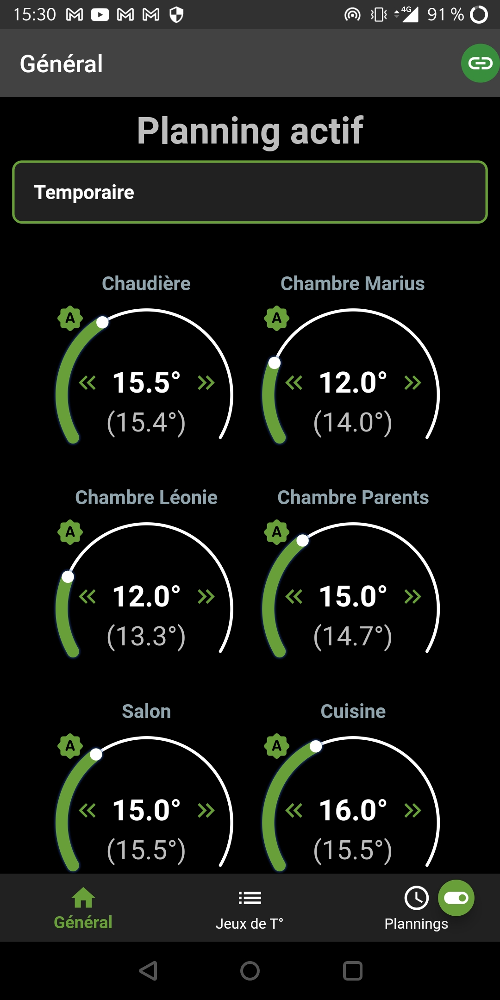
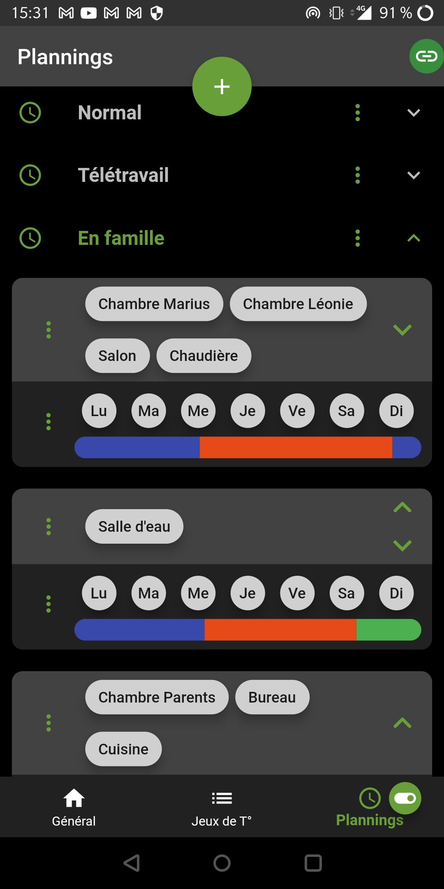
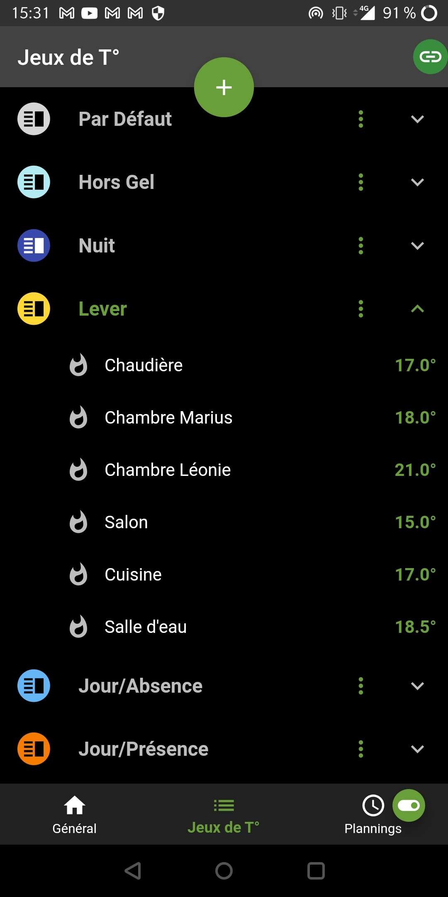

# Heating Control App
#### A Mobile and desktop app to control your heating with daily schedules

<p align="middle">
	
</p>

##

This flutter app is part of the "heating control project" and acts as a flutter client for the "heating control server".
For more information about the project, see the server repository located here : [heating_control_server]

The app connects to a MQTT broker to  :
- subscribe to all data published  by the heating control server (devices data, shedules, ...)
- send commands (like a new setpoint) to the server

> Note: French and english languages are available in the app 

## Target platforms
This flutter app can be run on the following targets :
- Android device,
- Windows, as a desktop application
- Browser

## Some Screenshots
<p float="left">
  
   
  
</p>

## Features
- Show current temperature and setpoint of each thermostat configured in server
- Manual change any thermostat setpoint
- Select current schedule 
- Manage temperature sets
- Manage schedules

## TODO
- Add setting to choose the first day of week
- Add auto-tests

## Tech and dependencies
This app uses a number of tech and projects to work properly:
- [Flutter] - Build apps for any screen
- [MQTT] - The Standard for IoT Messaging

And it depends on following flutter plugins :
- [mqtt_client] - A server and browser based MQTT client for Dart
- [navbar_router] - A custom BottomNavigationBar
- [flutter_colorpicker] - A color picker inspired by all the good design for your amazing flutter apps
- [flutter_picker] - A Flutter picker plugin
- [selectable_list] - A flutter selectable list plugin
- [flutter_launcher_icons] - A command-line tool which simplifies the task of updating your Flutter app's launcher icon
- [sleek_circular_slider] - A highly customizable circular slider/progress bar & spinner for Flutter

## Installation

> You must install first a heating control server along with a MQTT broker

#### 1- Edit configuration file (optional)
- in `assets/cfg/config.yaml`, set mqtt/port and mqtt/secure fields
- create `assets/cfg/secrets.yaml` and set brokerAddress, user and password in mqtt section

  Example of secrets.yaml file :
  ```yaml
  mqtt:
    brokerAddress: mybroker.com
    user: mqtt_user
    password: superpass_12
  ```
> Note: connexion parameters can also be set in running app, using the settings page 

#### 2- Setup your Flutter dev environment
- Heating control App requires [Flutter] to build.
- Go to https://docs.flutter.dev/get-started/install and follow instructions.
- Use the following tool chain :
  - Android Studio : Android Studio Ladybug | 2024.2.1 Patch 3
  - Flutter : 3.16.4 (very important, do not use a more recent version)
To use the correct flutter version, do the following :
    ```sh
    cd <flutter_git_dir>
    git checkout <flutter_version>
    flutter doctor -v
    ```
  - Java JDK : 18.0
To make flutter use the correct version of the JDK, do the following :
    ```sh
    flutter config --jdk-dir <jdk_install_dir>
    ```

#### 3- Build the app
- On android (complete instructions in https://docs.flutter.dev/deployment/android to build the apk)
From the repo root folder, type :
    ```sh
    flutter pub get
    flutter build apk --split-per-abi
    flutter install --use-application-binary=build\app\outputs\flutter-apk\app-arm64-v8a-release.apk
    ```
    The last command installs the apk on the connected android device
    > Note: Please replace `app-arm64-v8a-release.apk` by the flavor needed by your device. The built apk files are located in `.\build\app\outputs\flutter-apk\`.

- On Windows (complete instructions in https://docs.flutter.dev/deployment/windows to build the exe)
From the repo root folder, type :
    ```sh
    flutter build windows
    ```
    The built exe is located in `.\build\windows\x64\runner\Release\`

## Other
This README has been written using [Dillinger]

[//]: # (These are reference links used in the body of this note and get stripped out when the markdown processor does its job. There is no need to format nicely because it shouldn't be seen. Thanks SO - http://stackoverflow.com/questions/4823468/store-comments-in-markdown-syntax)

  [heating_control_server]: <https://github.com/celariss/heating_control_server/>
  [flutter]: <https://flutter.dev/>
  [mqtt]: <https://mqtt.org/>
  [mqtt_client]: <https://pub.dev/packages/mqtt_client>
  [navbar_router]: <https://pub.dev/packages/navbar_router>
  [flutter_colorpicker]: <https://pub.dev/packages/flutter_colorpicker>
  [flutter_picker]: <https://pub.dev/packages/flutter_picker>
  [selectable_list]: <https://pub.dev/packages/selectable_list>
  [flutter_launcher_icons]: <https://pub.dev/packages/flutter_launcher_icons>
  [sleek_circular_slider]: <https://pub.dev/packages/sleek_circular_slider>
  [dillinger]: <https://dillinger.io/>